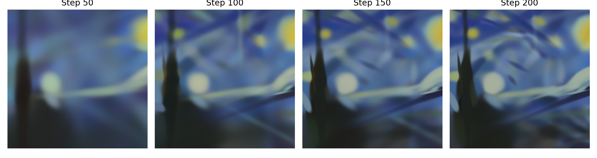
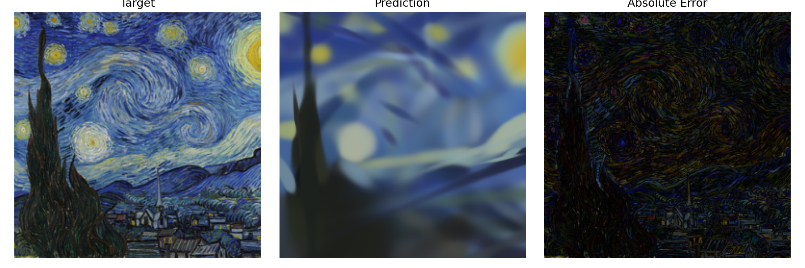

# 实验 1：CM2026 Project 1

一幅图像由许多微粒共同构成。每个微粒对应一个可学习的 2D Gaussian，具有位置、尺度、颜色，以及可选透明度。本实验的任务是：给定一张目标图像，利用一组可学习的 2D Gaussians 对其进行重建，并比较不同设计对优化效果的影响。

本仓库提供了可运行基线，以及 loss、初始化策略、优化器、学习率调度器等扩展接口，供消融实验和竞赛使用。优化问题的形式化定义见 [docs/problem_formulation.md](docs/problem_formulation.md)。

优化过程中，高斯微粒会逐步移动、缩放并变色，从而逼近目标图像：

<p align="center">
  
  <br>
  <em>从左到右：第 50 / 100 / 150 / 200 步的重建结果</em>
</p>

## 一、快速开始

下图展示了基线配置（100 个高斯，MSE loss，Adam 优化器）在 200 步训练后的效果：

<p align="center">
  
  <br>
  <em>左：目标图像 | 中：高斯重建 | 右：绝对误差</em>
</p>

1. 安装依赖：

```bash
pip install -r requirements.txt
```

2. 运行默认训练：

```bash
python train.py
```

默认配置定义在 [config.py](config.py) 中。

## 二、实验要求

1. 实验目标：

- 理解教学版 2D Gaussian Splatting 的基本训练流程。
- 实现并比较不同的 loss、初始化策略、优化器、模型设计与学习率调度器。
- 在统一基线下完成消融实验，并进一步参加课程竞赛。

2. 建议完成顺序：

- 先运行默认基线，确认训练流程与输出结果正常。
- 再补全指定源码文件。
- 按模块完成消融实验。
- 最后整理最佳配置并完成竞赛部分。

3. 评分构成：

| 部分 | 占比 |
| ---- | ---- |
| 消融 A：Loss 函数 | 12% |
| 消融 B：初始化策略 | 12% |
| 消融 C：优化器 | 12% |
| 消融 D：模型设计 | 12% |
| 消融 E：学习率调度器 | 12% |
| 竞赛 Sprint（100步迭代） | 20% |
| 竞赛 Standard（500步迭代）| 20% |
| 合计 | 100% |

4. 最低必做项：

| 类型 | 文件 |
| ---- | ---- |
| 必做 | [student/losses.py](student/losses.py) |
| 必做 | [student/schedulers.py](student/schedulers.py) |
| 必做 | [student/optimizers.py](student/optimizers.py) |
| 必做 | [student/initializers.py](student/initializers.py) |
| 选做 | [student/optimizers.py](student/optimizers.py) 中的 muon 优化器 |

建议先完成所有必做项，再进入竞赛部分。

## 三、实验报告要求

1. 报告建议结构：

- （a）实验设置：
  简要说明你使用的基线配置，以及实现了哪些模块。
- （b）消融实验结果：
  按 A-E 五个消融实验整理结果。每部分至少给出结果表，并统一汇报 `PSNR / MSE / MAE`。
- （c）结果分析：
  结合 loss 曲线、重建图、误差图分析不同方法的收敛速度、稳定性和最终效果。
- （d）竞赛结果：
  单独汇报 Sprint 和 Standard 两个赛道的结果，并简要说明最终采用的设计，阐述原因。
- （e）结论：
  总结哪些设计有效，哪些设计效果一般，以及你对该任务的主要观察。补充说明如果要提升这个任务，还能想到哪些优化方法。

2. 报告中建议至少包含以下内容：

- （a）默认基线结果。
- （b）五个消融实验的结果表。
- （c）若干代表性的 loss 曲线或指标曲线。
- （d）若干代表性的重建对比图或误差图。
- （e）竞赛部分的最终数值结果与设计说明。

3. 提交内容：

- （a）实验报告：`pdf` 格式。
- （b）代码：可直接运行的 Python 代码。

4. 压缩包组织示例：

```text
姓名_学号_Project1_v1.zip
|
|-- report.pdf
|
|-- minimal_2dgs/
|   |-- train.py
|   |-- config.py
|   |-- student/
|   |   |-- losses.py
|   |   |-- optimizers.py
|   |   |-- initializers.py
|   |   |-- schedulers.py
|   |-- ...
```

如课程主页对文件命名或提交方式有额外要求，以课程主页为准。

## 四、你主要会看哪些文件

第一次阅读代码时，不需要把整个项目全部看一遍。对大多数同学来说，先理解下面这几个文件即可：

- [config.py](config.py)
- [train.py](train.py)
- [student/losses.py](student/losses.py)
- [student/optimizers.py](student/optimizers.py)
- [student/initializers.py](student/initializers.py)
- [student/schedulers.py](student/schedulers.py)

1. 配置入口：

- [config.py](config.py)：集中定义目标图、模型、训练步数、loss、优化器、学习率调度器等配置。

2. 常见修改项：

- `config.target`：目标图来源、图像尺寸、txt 路径。
- `config.model`：高斯数量、是否启用各向异性、是否启用 alpha。
- `config.initializer`：初始化策略。
- `config.loss`：loss 类型。
- `config.optimizer`：优化器类型、学习率与参数组学习率缩放。
- `config.scheduler`：学习率调度器。
- `config.train`：训练步数、保存频率、是否导出动画。

3. 主要作业文件：

| 模块 | 文件 | 说明 |
| ---- | ---- | ---- |
| Loss | [student/losses.py](student/losses.py) | 实现 `l1`、`charbonnier`、`mse_l1`、`mse_edge` |
| Scheduler | [student/schedulers.py](student/schedulers.py) | 实现 `cosine`、`warmup_cosine`、`step_decay` |
| Optimizer | [student/optimizers.py](student/optimizers.py) | 实现 SGD、Momentum、Adam、AdamW（选做：Muon） |
| Initializer | [student/initializers.py](student/initializers.py) | 实现 `grid` 和 `image_sample` 初始化 |

## 五、训练输出

训练结束后，默认会在 `outputs/` 下保存：

- `target.png`：目标图像。
- `reconstruction_final.png`：最终重建结果。
- `comparison.png`：目标图、重建图与绝对误差对比。
- `loss_curve.png`：总 loss 曲线。
- `metric_curves.png`：训练指标曲线。
- `metric_history.json`：逐步记录的训练指标。
- `metrics.txt`：最终评估指标。
- `recon_step_*.png`：训练过程中的中间结果。

若 `config.train.save_video = True`，还会额外导出优化过程动画。

## 六、文档导航

- [docs/problem_formulation.md](docs/problem_formulation.md)：优化问题形式化。
- [docs/ablation_experiments.md](docs/ablation_experiments.md)：消融实验要求。
- [docs/competition.md](docs/competition.md)：竞赛规则与提交方式。

## 七、竞赛自测

如果你要参加竞赛，建议先复制模板文件，再做本地自测。

1. 新建竞赛配置文件：

```bash
cp experiments/competition_settings_template.py experiments/competition_settings.py
```

然后在 `experiments/competition_settings.py` 中填写：

- `get_sprint_setting()`
- `get_standard_setting()`
2. 同时测试两个赛道：

```bash
python experiments/run_competition_local.py --config experiments/competition_settings.py --track both
```

说明：

- `--track sprint` 只跑 100 步赛道。
- `--track standard` 只跑 500 步赛道。
- `--track both` 会依次跑两个赛道。
- `--limit 2` 表示只跑前 2 张测试图，适合先检查代码是否能正常运行。

## 八、代码结构

- `train.py`：训练入口与主训练循环。
- `config.py`：结构化配置。
- `models.py`：高斯参数模型。
- `renderer.py`：可微渲染器。
- `student/`：学生需要修改的代码，包括 `losses.py`、`optimizers.py`、`initializers.py`、`schedulers.py`。
- `target_generators.py`：目标图生成与 txt 高斯渲染。
- `generate_target.py`：单独生成目标图像，用于预览和调试。
- `evaluation.py`：评估指标与可视化保存。
- `experiments/`：竞赛 setting 模板与本地自测脚本。

## 九、补充说明

- 竞赛评分细则仅供参考，后续可能微调。
- 如需更细致的实验对比，可自行扩展可视化，仅供报告中的图像制作、帮助自己调试，无需上传这部分代码。

## 十、学术诚信

请独立完成本次作业。

- 可以阅读课程提供的代码、文档与参考资料。
- 可以与同学讨论思路，但不得直接交换代码、实验结果或报告文本。
- 不得抄袭或改写他人实现后冒充为自己的工作。
- 如使用课外资料、工具或生成式 AI，请遵守课程要求并如实说明用途。
- 提交的代码、结果和分析必须与本人实际实现一致。
