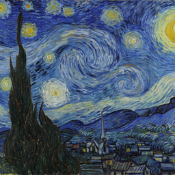
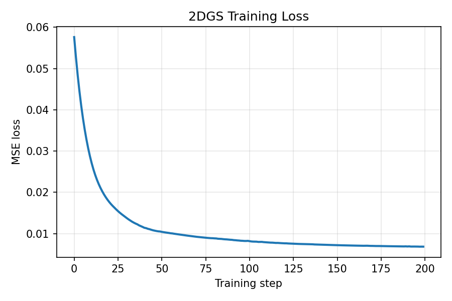

# 实验 1：星光修复师

## 一、故事背景

在遥远的「光栅王国」里，所有图像都不是由像素直接绘制出来的，而是由许多漂浮在空中的星光微粒组成。

每一颗星光微粒都拥有自己的：

- 位置
- 扩散范围
- 颜色

当许多微粒在空中彼此叠加时，就会形成一张完整的图像。  
远远望去，那些微粒像夜空中的群星；但当它们被精确地排列与调节时，就能重现山川、湖泊、人物与晨曦。

光栅王国的古代档案馆中，保存着许多珍贵画卷。但其中一幅名为《晨曦之印》的图像已经严重受损，只剩下一张目标观测图。修复师们无法直接逐像素描摹它，只能召唤有限数量的星光微粒，让这些微粒自动移动、调整大小与颜色，最终重新拼出原图。

<p align="center">
  
</p>

现在，你将扮演一名 **星光修复师**。

你手中拥有 `N` 颗可操控的星光微粒，也就是一组可学习的高斯：

- 每颗微粒有自己的位置
- 每颗微粒有自己的大小与形状
- 每颗微粒有自己的 RGB 颜色
- 某些情况下，它们还可以拥有透明度

这些微粒经过叠加后会生成一张图像。你的目标，就是不断调整这些微粒的参数，使生成图像尽可能接近目标图像。

但修复的关键不只在于“会不会调”，还在于“怎么调得更快、更稳、更准”。

不同的优化策略，就像不同流派的修复术：

- 有的朴素直接，但容易走弯路
- 有的会记住过去的移动方向，更擅长穿越狭长山谷
- 有的会根据局部变化自动调整步伐，看起来更加灵活

因此，这个实验不仅要求你完成修复，还要求你比较不同“修复术”在不同设置下的表现，分析：

- 谁收敛更快
- 谁更稳定
- 谁对初始摆放更敏感
- 当星光微粒数量变化时，修复能力会如何改变

最终，你需要向王国档案馆提交你的修复方案，并解释：

- 为什么你的方法有效
- 为什么某些设计是必要的
- 为什么某些策略比其他策略更适合这个任务

---

## 二、实验目标

本实验基于 2D Gaussian Splatting 图像拟合任务。给定一张目标图像，系统会用一组 2D 高斯函数的加权混合去逼近它，并通过梯度优化不断改善拟合质量。

下图展示了基线配置（100 个高斯，MSE loss，Adam 优化器）在 200 步训练后的效果：

<p align="center">
  
  <br>
  <em>左：目标图像 | 中：高斯重建 | 右：绝对误差</em>
</p>

优化过程中，高斯微粒逐步移动、缩放、变色，逼近目标图像：

<p align="center">
  
  <br>
  <em>从左到右：第 50 / 100 / 150 / 200 步的重建结果</em>
</p>

你拿到的 starter code 已经可以运行：

```bash
python main.py
```

默认基线已经具备以下能力：

- 读取或生成目标图像
- 用一组高斯渲染出重建图像
- 计算 loss
- 使用优化器进行训练
- 保存中间结果、最终结果和评估指标

本实验的核心任务有两类：

1. **实现缺失模块**
2. **通过系统实验分析这些模块是否真的有效**

最后，你还需要在竞赛部分追求尽可能高的平均 PSNR。

---

## 三、你要扮演的角色

你不是“调一个能跑的程序”就结束，而是要像真正的修复师一样思考：

- 这组高斯一开始应该摆在哪里
- 它们应该怎么更新
- 哪种 loss 更适合图像修复
- 哪种设置更适合快收敛，哪种更适合高精度

也就是说，本实验既考察实现能力，也考察实验设计能力和分析能力。

---

## 四、基线代码已提供的模块

| 模块 | 已提供 | 需要你实现 |
| ---- | ---- | ---- |
| Loss | `mse` | 至少 2 种其他 loss |
| Optimizer | `torch_adam`（PyTorch 内置） | `student_sgd`, `student_momentum`, `student_adam` |
| Scheduler | `constant`（不调度） | 至少 1 种调度器（如 cosine） |
| Initializer | `random` | 至少 1 种图像感知初始化 |
| Model | 各向异性 / 透明度开关已内置 | 无需实现，仅需对比分析 |
| 参数分组 | 接口已内置 | 无需实现，仅需调参对比 |

---

## 五、第一部分：消融实验（60 分）

### 5.1 实验原则

消融实验的核心原则是：

> **每次只改变一个模块，其余设置保持默认基线不变。**

这样你才能隔离出某一个模块到底带来了什么贡献。

### 5.2 默认基线配置

```python
config = Config()
config.model.num_gaussians = 100
config.train.num_steps = 500
config.system.seed = 42
config.target.image_size = 256
config.render.bg_color = (0.0, 0.0, 0.0)
config.target.name = "image"  # Starry Night
config.loss.name = "mse"
config.optimizer.name = "torch_adam"
config.optimizer.torch_adam.lr = 5e-2
config.scheduler.name = "constant"
config.initializer.name = "random"
config.model.use_anisotropic = True
config.model.use_alpha = True
```

你需要自己编写实验脚本，批量运行不同配置、收集结果并生成图表。这本身也是实验能力的一部分。

以下是基线配置的 loss 曲线示例：

<p align="center">
  
  <br>
  <em>基线 loss 曲线（MSE loss，Adam，200 步）</em>
</p>

---

### 5.3 消融 A：Loss 函数（12 分）

#### 实现要求

在 `losses.py` 中实现至少 2 种新的 loss。已有的 stub 函数（`l1_loss`、`mse_l1_loss` 等）已在 `build_loss` 中注册，补全即可使用。

如果你想自定义全新的 loss，只需创建 `losses_xxx.py` 文件，定义 `xxx_loss(prediction, target)` 函数，然后设置 `config.loss.name = "xxx"`，框架会自动加载。

建议实现：

| 编号 | Loss | 说明 |
| ---- | ---- | ---- |
| A1 | `mse` | 均方误差，已提供，作为基线 |
| A2 | `l1` | 绝对值误差 |
| A3 | `mse_l1` | MSE + L1 混合 |

你也可以自行设计其他 loss。

#### 实验要求

固定其他模块为基线，仅替换 loss，对比：

- PSNR
- MSE
- MAE

#### 需要提交

- 你实现的 loss 代码
- 各组实验结果表格
- loss 曲线对比图
- 文字分析，不超过 300 字：
  哪个 loss 效果最好？为什么不同 loss 表现不同？

---

### 5.4 消融 B：初始化策略（12 分）

#### 实现要求

在 `initializers/` 下实现至少 1 种图像感知初始化策略。已有的 stub 文件（`image_sample_init.py`、`bright_spot_init.py`）已在工厂中注册，补全即可使用。

如果你想自定义全新的初始化器，只需创建 `initializers/xxx_init.py` 文件，定义一个以 `Initializer` 结尾的类（需有 `initialize(model, target_image)` 方法），然后设置 `config.initializer.name = "xxx"`，框架会自动加载。

参考 `initializers/custom_initializer_template.py` 的接口。你的初始化器会收到 `target_image`，可以利用它来决定高斯的初始位置和颜色。

建议实现思路：

- 图像采样初始化：随机放置中心，但从目标图像对应位置采样颜色
- 亮度感知初始化：优先将高斯放在亮度更高的区域

| 编号 | Initializer | 说明 |
| ---- | ---- | ---- |
| B1 | `random` | 随机初始化，已提供，作为基线 |
| B2 | 你的实现 | 图像感知初始化 |

#### 实验要求

固定其他模块为基线，仅替换初始化策略。

#### 需要提交

- 你实现的初始化代码
- 各组实验 PSNR 表格
- loss 曲线对比图
  重点观察前 50 步的收敛速度差异
- 文字分析，不超过 300 字：
  图像感知初始化的优势体现在哪里？

---

### 5.5 消融 C：优化器（12 分）

#### 实现要求

补全以下三个优化器文件：

- `optimizers/student_sgd.py`
- `optimizers/student_momentum.py`
- `optimizers/student_adam.py`

优化器的进阶路线是：

> **SGD → SGD + Momentum → Adam**

每一步都对应一个明确的设计改进。

参考 `optimizers/custom_optimizer_template.py` 了解接口。优化器需要实现：

- `zero_grad()`
- `step()`

注意每个参数组有独立学习率 `group["lr"]`。

如果你想自定义全新的优化器，只需创建 `optimizers/xxx.py` 文件，定义一个接受 `param_groups` 参数并实现 `zero_grad()` 和 `step()` 方法的类，然后设置 `config.optimizer.name = "xxx"`，框架会自动加载。

| 编号 | Optimizer | 说明 |
| ---- | ---- | ---- |
| C1 | `torch_adam` | PyTorch 内置 Adam，已提供，作为基线 |
| C2 | `student_sgd` | 你实现的 SGD |
| C3 | `student_momentum` | 你实现的 SGD + Momentum |
| C4 | `student_adam` | 你实现的 Adam |

#### 实验要求

固定其他模块为基线，仅替换优化器。

#### 正确性验证

在相同配置下，`student_adam` 与 `torch_adam` 的 PSNR 差异应小于 `0.5 dB`。如果差异过大，说明实现可能存在问题。

#### 需要提交

- 三个优化器的实现代码
- 各组实验 PSNR 表格
- loss 曲线对比图
- 文字分析，不超过 300 字：
  SGD → Momentum → Adam 每一步带来了什么改进？

---

### 5.6 消融 D：模型设计（12 分）

这一部分**无需实现新代码**，只需修改配置，对比以下 4 种组合：

| 编号 | use_anisotropic | use_alpha | 说明 |
| ---- | ---- | ---- | ---- |
| D1 | `False` | `False` | 各向同性 + 不透明 |
| D2 | `True` | `False` | 各向异性 + 不透明 |
| D3 | `False` | `True` | 各向同性 + 透明 |
| D4 | `True` | `True` | 各向异性 + 透明，作为基线 |

#### 实验要求

固定其他模块为基线，仅切换模型开关。

#### 需要提交

- 4 组实验的 PSNR 表格
- 最终重建结果的视觉对比图
- 文字分析，不超过 300 字：
  各向异性和透明度各自带来多少提升？哪个影响更大？二者是否互补？

---

### 5.7 消融 E：学习率调度器（12 分）

#### 实现要求

在 `schedulers.py` 中实现至少 1 种学习率调度器。

调度器是一个函数：

```python
(step, total_steps) -> lr_multiplier
```

返回值在 `[min_lr_scale, 1.0]` 之间，每步乘以所有参数组的 `base_lr`。

建议实现：

| 编号 | Scheduler | 说明 |
| ---- | ---- | ---- |
| E1 | `constant` | 不调度，已提供，作为基线 |
| E2 | `cosine` | 余弦退火 |
| E3 | `warmup_cosine` | 线性预热 + 余弦退火，可作为 bonus |

**cosine 公式：**

```text
scale = min_scale + 0.5 * (1 - min_scale) * (1 + cos(pi * step / total))
```

#### 实验要求

固定其他模块为基线，仅替换调度器。

#### 需要提交

- 你实现的调度器代码
- 各组实验 PSNR 表格
- loss 曲线对比图
- 文字分析，不超过 300 字：
  调度器对最终 PSNR 有多大影响？在哪个训练阶段最关键？

---

## 六、第二部分：竞赛（40 分）

### 6.1 竞赛设定

完成前面的消融后，你将以星光修复师的身份参加档案馆的修复竞赛。

目标是：

> 在 10 张测试图像上，使平均 PSNR 尽可能高。

你可以自由组合所有模块与超参数，但必须遵守统一的硬约束。

### 6.2 硬约束

以下设置不可修改：

| 参数 | 值 |
| ---- | ---- |
| 高斯数量 | 200 |
| 背景色 | 黑色 `(0.0, 0.0, 0.0)` |
| 随机种子 | 42 |
| 图像大小 | `256 × 256` |

### 6.3 两个赛道

| 赛道 | 训练步数 | 侧重点 |
| ---- | ---- | ---- |
| Sprint | 100 步 | 快速收敛能力 |
| Standard | 500 步 | 整体拟合质量 |

### 6.4 你可以调什么

你可以调节：

- Loss 函数及其超参数
- 初始化策略及其超参数
- 优化器及其超参数
- 学习率调度器及其超参数
- 参数分组学习率倍率
- 模型开关（各向异性、透明度）
- 你自己新增的优化器、初始化器、loss 或调度器

### 6.4.1 自定义模块命名规范

框架支持自动加载自定义模块，无需修改工厂代码：

| 模块类型 | 文件位置 | 命名要求 | 配置方式 |
| ---- | ---- | ---- | ---- |
| Loss | `losses_xxx.py`（项目根目录） | 定义 `xxx_loss(pred, target)` 或 `loss(pred, target)` | `config.loss.name = "xxx"` |
| Initializer | `initializers/xxx_init.py` | 定义以 `Initializer` 结尾的类 | `config.initializer.name = "xxx"` |
| Optimizer | `optimizers/xxx.py` | 定义有 `zero_grad()` 和 `step()` 的类 | `config.optimizer.name = "xxx"` |

提交竞赛配置时，如果使用了自定义模块，请一并提交对应的源文件。

### 6.5 策略提示

- Sprint 赛道只有 100 步，初始化质量和学习率策略非常重要
- 参数分组可以让位置参数学得更快、颜色参数学得更稳
- 调度器往往在训练后期更有价值
- 不同类型的目标图像可能适合不同策略

---

## 七、测试图像

竞赛使用 10 张测试图像，评分取 10 张图的平均 PSNR。

### 7.1 真实 RGB 图像（256×256）

<p align="center">
  
  <br>
  <em>从左到右：R1 星空 | R2 黑天鹅 | R3 火烈鸟 | R4 汽车 | R5 跑酷</em>
</p>

| 编号 | 文件 | 描述 |
| ---- | ---- | ---- |
| R1 | `data/Starry_Night_256.png` | 梵高《星空》，复杂纹理和颜色渐变 |
| R2 | `data/competition/blackswan_256.png` | 黑天鹅，自然场景，水面反射 |
| R3 | `data/competition/flamingo_256.png` | 火烈鸟，细节纹理，水面倒影 |
| R4 | `data/competition/car-roundabout_256.png` | 汽车，城市场景，几何结构 |
| R5 | `data/competition/parkour_256.png` | 跑酷人物，建筑背景，混合场景 |

### 7.2 txt 合成高斯目标

<p align="center">
  
  <br>
  <em>从左到右：S1 稀疏彩色 | S2 密集半透明 | S3 各向异性 | S4 半透明灰色 | S5 彩色</em>
</p>

| 编号 | 文件 | 描述 |
| ---- | ---- | ---- |
| S1 | `data/competition/t3_sparse_colorful.txt` | 15 个稀疏彩色高斯，简单场景 |
| S2 | `data/competition/t4_dense_cluster.txt` | 30 个密集半透明高斯，测试遮挡处理 |
| S3 | `data/competition/t5_anisotropic_mix.txt` | 20 个各向异性旋转高斯，测试方向拟合 |
| S4 | `data/examples/04_ten_translucent_stars.txt` | 10 个半透明灰色高斯 |
| S5 | `data/examples/05_ten_colorful_stars.txt` | 10 个彩色高斯 |

---

## 八、评分标准

每个赛道独立排名，按 **10 张图平均 PSNR** 从高到低排序。

| 排名百分位 | 得分（每赛道满分 20 分） |
| ---- | ---- |
| Top 10% | 20 |
| Top 30% | 17 |
| Top 50% | 14 |
| Top 70% | 11 |
| 其余 | 8（参与分） |

两个赛道总分：

```text
Sprint 得分 + Standard 得分
```

满分 40 分。

---

## 九、如何自测

```bash
python experiments/run_competition.py --config experiments/my_competition_config.py
```

脚本会依次在 10 张测试图上运行你的配置，并输出：

- 每张图的 PSNR
- 平均 PSNR

---

## 十、提交要求

1. 提交 `my_competition_config.py`
2. 如有自定义模块（优化器 / 初始化 / loss / 调度器），一并提交源文件
3. 提交简短说明，不超过 500 字：
   解释你的配置策略和选择理由

### 提交模板

```python
from config import Config


def get_sprint_config() -> Config:
    """Sprint 赛道：100 步，追求快速收敛。"""
    config = Config()
    # === 硬约束，不要修改 ===
    config.model.num_gaussians = 200
    config.render.bg_color = (0.0, 0.0, 0.0)
    config.system.seed = 42
    config.target.image_size = 256
    config.train.num_steps = 100
    # === 以下自由配置 ===
    config.loss.name = "mse"
    config.initializer.name = "random"
    config.optimizer.name = "torch_adam"
    config.optimizer.torch_adam.lr = 5e-2
    config.scheduler.name = "constant"
    config.optimizer.param_groups.center_lr_scale = 1.0
    config.optimizer.param_groups.color_lr_scale = 1.0
    config.model.use_anisotropic = True
    config.model.use_alpha = True
    return config


def get_standard_config() -> Config:
    """Standard 赛道：500 步，追求最高 PSNR。"""
    config = Config()
    # === 硬约束，不要修改 ===
    config.model.num_gaussians = 200
    config.render.bg_color = (0.0, 0.0, 0.0)
    config.system.seed = 42
    config.target.image_size = 256
    config.train.num_steps = 500
    # === 以下自由配置 ===
    config.loss.name = "mse"
    config.initializer.name = "random"
    config.optimizer.name = "torch_adam"
    config.optimizer.torch_adam.lr = 5e-2
    config.scheduler.name = "constant"
    config.optimizer.param_groups.center_lr_scale = 1.0
    config.optimizer.param_groups.color_lr_scale = 1.0
    config.model.use_anisotropic = True
    config.model.use_alpha = True
    return config
```

---

## 十一、总评分

| 部分 | 满分 |
| ---- | ---- |
| 消融 A：Loss 函数 | 12 |
| 消融 B：初始化策略 | 12 |
| 消融 C：优化器 | 12 |
| 消融 D：模型设计 | 12 |
| 消融 E：学习率调度器 | 12 |
| 竞赛 Sprint 赛道 | 20 |
| 竞赛 Standard 赛道 | 20 |
| **合计** | **100** |


## 优化问题形式化

从计算方法的角度看，本实验本质上是一个**高维、无约束、非线性优化问题**。  
我们的目标是：通过不断调整一组 2D 高斯的参数，使渲染图像尽可能逼近给定的目标图像。

### 1. 目标图像与参数化表示

设目标图像为：

$$
I^\star : \Omega \to [0,1]^3
$$

其中：

- $\Omega = \{1,\dots,H\} \times \{1,\dots,W\}$ 表示图像的像素网格；
- 每个像素对应一个 RGB 三维向量。

我们用 $N$ 个二维高斯来表示一张图像。第 $i$ 个高斯的参数记为：

$$
\theta_i = (\mu_i, \Sigma_i, c_i, \alpha_i)
$$

其中：

- $\mu_i = (x_i, y_i) \in \mathbb{R}^2$：高斯中心；
- $\Sigma_i \in \mathbb{R}^{2 \times 2}$：高斯形状矩阵；
- $c_i \in [0,1]^3$：RGB 颜色；
- $\alpha_i \in [0,1]$：透明度。

将所有高斯参数拼成总参数向量：

$$
\Theta = (\theta_1, \theta_2, \dots, \theta_N)
$$

说明：

- 当 `use_anisotropic = False` 时，$\Sigma_i = \sigma_i^2 I$，即各向同性高斯；
- 当 `use_alpha = False` 时，可视为 $\alpha_i = 1$，即不透明。

---

### 2. 渲染模型

对任意像素位置 $p \in \Omega$，第 $i$ 个高斯对该像素的权重定义为：

$$
w_i(p;\Theta)
=
\alpha_i
\exp\left(
-\frac{1}{2}(p-\mu_i)^\top \Sigma_i^{-1}(p-\mu_i)
\right)
$$

于是渲染图像 $I_\Theta$ 定义为：

$$
I_\Theta(p)
=
\frac{\sum_{i=1}^N w_i(p;\Theta)\,c_i}
{\sum_{i=1}^N w_i(p;\Theta)+\varepsilon},
\qquad p \in \Omega
$$

其中 $\varepsilon > 0$ 是一个很小的常数，用于避免分母为零。  
在本实验中，背景色默认设为黑色。

---

### 3. 损失函数

最基础的目标是让渲染图像尽可能接近目标图像，因此定义经验损失函数：

$$
\mathcal{L}(\Theta)
=
\frac{1}{|\Omega|}
\sum_{p \in \Omega}
\|I_\Theta(p) - I^\star(p)\|_2^2
$$

这就是基线代码中使用的 **MSE loss**。

如果使用其他损失函数，例如 $L_1$ 或混合损失，也可以统一写成：

$$
\min_{\Theta} \mathcal{L}(\Theta)
$$

---

### 4. 优化问题

因此，本实验可以形式化为如下优化问题：

$$
\boxed{
\min_{\Theta} \mathcal{L}(\Theta)
}
$$

其中 $\Theta$ 是所有高斯的位置、形状、颜色和透明度参数组成的高维变量。

这是一个典型的：

- **非线性优化问题**：因为渲染公式对参数是非线性的；
- **高维优化问题**：因为多个高斯参数拼接后维度很高；
- **数值迭代问题**：通常难以直接写出解析解，需要用迭代方法逐步逼近最优解。

---

### 5. 与课程内容的联系

在计算方法课程中，我们会学习这样一类基本思想：

> 对于一个难以直接求解的优化问题，构造一个迭代序列  
> $\Theta^{(0)}, \Theta^{(1)}, \Theta^{(2)}, \dots$，  
> 使目标函数 $\mathcal{L}$ 逐步下降。

本实验中的优化器，本质上就是不同的**数值迭代格式**。

#### Gradient Descent / SGD

$$
\Theta^{(k+1)}
=
\Theta^{(k)} - \eta_k \nabla \mathcal{L}(\Theta^{(k)})
$$

即沿负梯度方向更新。

#### Momentum

在梯度下降基础上加入历史方向累积，用来减小震荡、加快收敛。

#### Adam

在动量思想之上进一步引入自适应步长，对不同参数采用不同尺度的更新。

因此，这次大作业并不是单纯“调一个图像程序”，而是在一个具体任务上实践课程中讲到的：

- 梯度下降法；
- 动量法；
- 自适应迭代法；
- 学习率调度；
- 初始化对收敛的影响；
- 模型参数化对优化难度的影响。

---

### 6. 评价指标与目标函数的关系

实验中常用 **PSNR** 评价重建质量。对于像素值范围在 $[0,1]$ 的图像，

$$
\mathrm{PSNR}
=
10 \log_{10}\frac{1}{\mathrm{MSE}}
$$

因此，当损失函数采用 MSE 时，**最小化 MSE 等价于最大化 PSNR**。  
这也是为什么竞赛部分采用平均 PSNR 作为最终排名指标。

---

### 7. 小结

从数值分析视角看，本实验研究的是：

> 在固定参数化模型下，如何通过不同迭代法更快、更稳定地求解一个高维非线性最优化问题。
