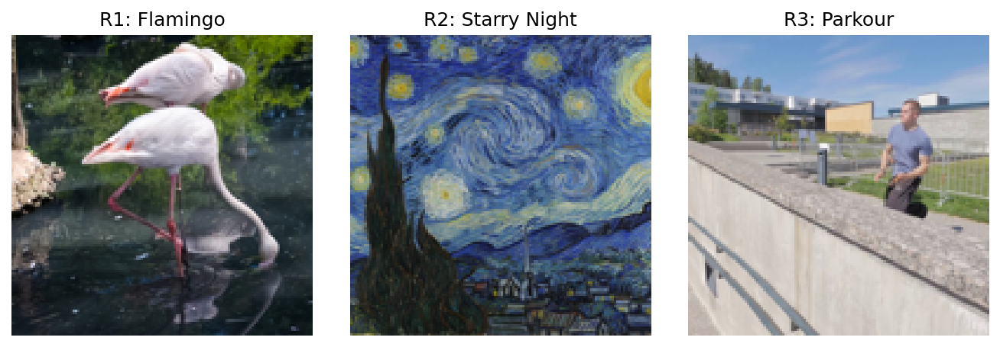
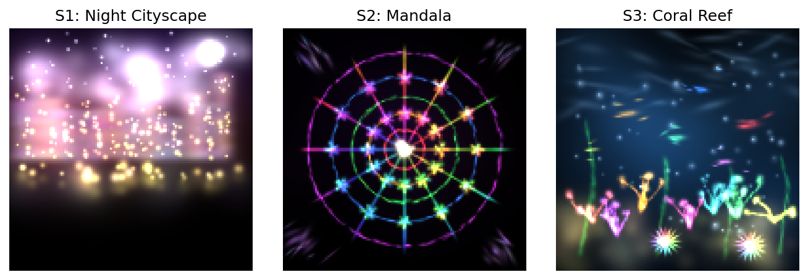

# 任务 2 说明

## 目标

自由组合模块和超参数，在测试图像上达到尽可能高的平均 PSNR。

建议先完成任务 1，再进入任务 2。

## 两种设置

| 设置 | 训练步数 | 重点 |
| ---- | ---- | ---- |
| 任务 2A | `100` | 快速收敛 |
| 任务 2B | `500` | 最终质量 |

## 硬约束

以下设置不可修改：

| 项目 | 约束 |
| ---- | ---- |
| 高斯数量 | `1000` |
| 背景色 | `(0.0, 0.0, 0.0)` |
| 随机种子 | `42` |
| 图像大小 | `128 x 128` |

## 可以调的内容

| 模块 | 可调内容 |
| ---- | ---- |
| Loss | 类型与超参数 |
| Initializer | 类型与超参数 |
| Optimizer | 类型与超参数 |
| Scheduler | 类型与超参数 |
| Param Groups | 各参数组 lr 倍率 |
| Model | 是否各向异性、是否启用 alpha |

## 测试图像

任务 2 使用 6 张测试图像，包括 3 张真实图像和 3 张合成图像。最终成绩取 6 张图的平均 PSNR。

| 编号 | 类型 | 说明 |
| ---- | ---- | ---- |
| R1 | 真实图像 | Flamingo（火烈鸟，色块简洁） |
| R2 | 真实图像 | Starry Night（星夜，绘画旋涡纹理） |
| R3 | 真实图像 | Parkour（跑酷，人物+建筑高频细节） |
| S1 | 合成目标 | Night Cityscape（城市夜景，823 高斯） |
| S2 | 合成目标 | Mandala（曼陀罗，1061 高斯） |
| S3 | 合成目标 | Coral Reef（珊瑚礁，1202 高斯） |

真实图像示意：

  

合成目标示意：

  

## 评分

每种设置单独按平均 PSNR 给分，满分 20 分。低于最低阈值不得分。

默认实现（random 初始化 + Adam）的平均 PSNR 大约为任务 2A `27.6 dB`、任务 2B `32.3 dB`。直接提交默认配置不能获得任务 2 分数。

### 任务 2A

| 平均 PSNR | 得分 |
| ---- | ---- |
| `>= 31.0 dB` | 20 |
| `>= 30.0 dB` | 16 |
| `>= 29.0 dB` | 12 |
| `>= 28.0 dB` | 8 |
| `< 28.0 dB` | 0 |

### 任务 2B

| 平均 PSNR | 得分 |
| ---- | ---- |
| `>= 34.7 dB` | 20 |
| `>= 34.0 dB` | 16 |
| `>= 33.0 dB` | 12 |
| `>= 32.5 dB` | 8 |
| `< 32.5 dB` | 0 |

任务 2 总分 = 任务 2A + 任务 2B，满分 40 分，占总评 40%。不采用同学之间的排名，按固定 PSNR 阈值给分。

## 验收内容

- 报告中需单独汇报任务 2A 和任务 2B 的结果，并简要说明最终采用的设计及原因。
- 如果你新增了优化器、初始化器、loss 或 scheduler，需要在对应的 `build_*` 函数中完成注册。
- 代码提交要求详见 [README.md](../README.md) 中的提交要求部分。
